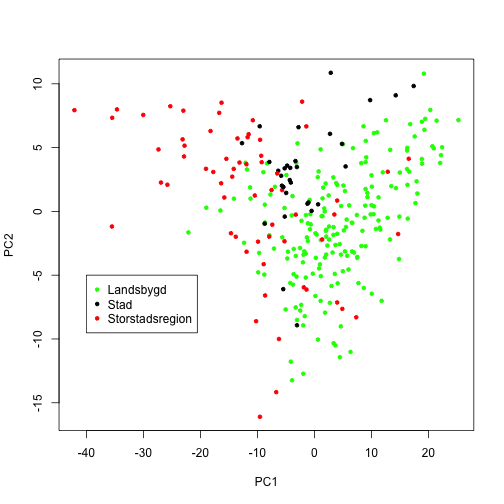
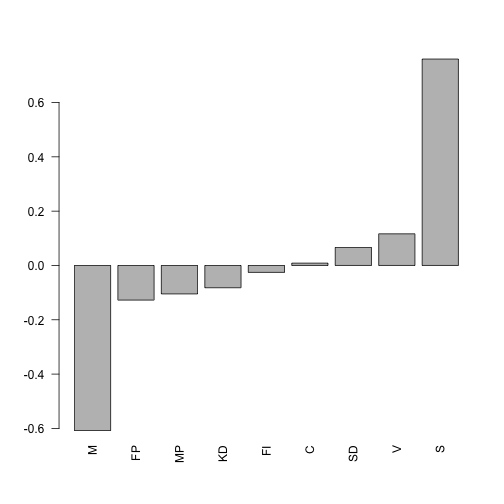
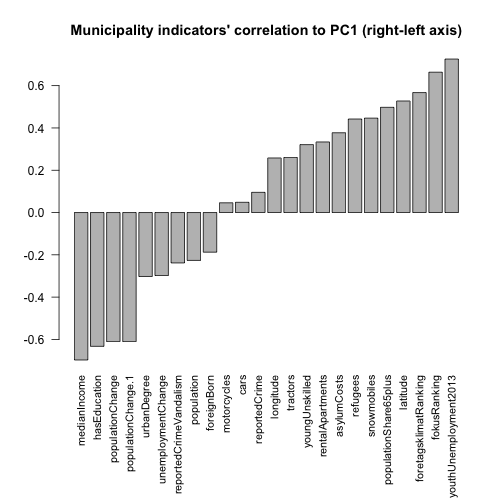
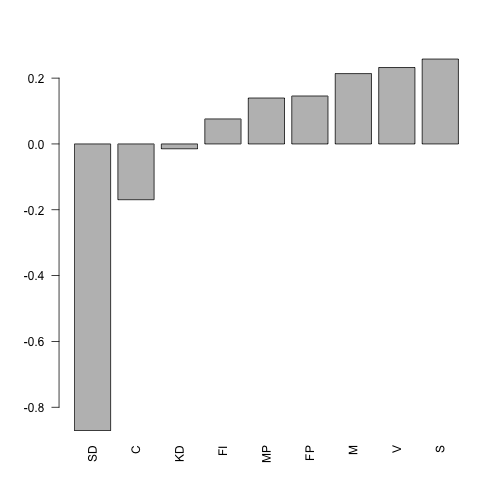
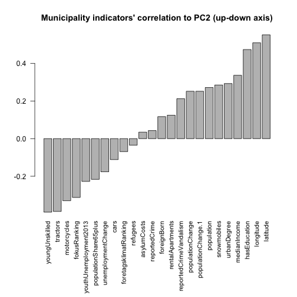
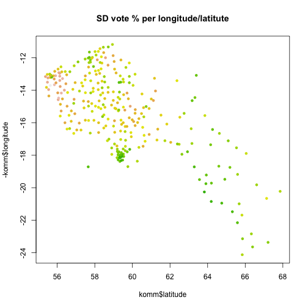
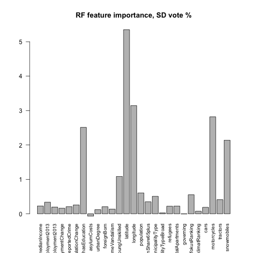
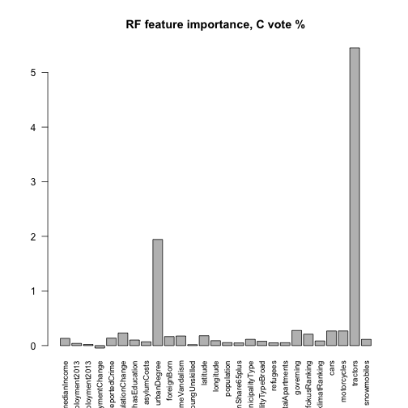
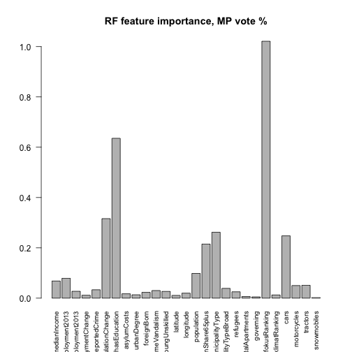

Swedish election data
========================================================

(Data provided by Jens Finnäs)

Load election results and data on municipalities.


```r
library("xlsx")
```

```
## Loading required package: rJava
## Loading required package: xlsxjars
```

```r
library("pheatmap")
library("calibrate")
```

```
## Loading required package: MASS
```

```r
library("randomForest")
```

```
## randomForest 4.6-10
## Type rfNews() to see new features/changes/bug fixes.
```

```r
load("valresultat.Rdata")
komm <- read.xlsx("kommundata.xlsx",1)
```
Extract 2014 election results on the municipality level. There are 290 municipalities. There is more fine grained data available, but we will use those later. 

Change column names to shorter ones for plotting purposes and replace NA values with zeroes, since that is what they represent in this case. 


```r
k <- res$kommun$val2014R
proc <- k[,c("PROCENT_M","PROCENT_C","PROCENT_FP","PROCENT_KD","PROCENT_S","PROCENT_V","PROCENT_MP","PROCENT_SD","PROCENT_FI")]
rownames(proc)<-k$ID
colnames(proc)<-c("M","C","FP","KD","S","V","MP","SD","FI")
```

Perform PCA on the matrix and color by municipality type.


```r
p <- prcomp(proc)

stopifnot(rownames(proc) == komm$code) # Check that municipalities are listed in the same order
regiontype <- komm$municipalityTypeBroad
colvec <- rep("black", length(regiontype))
colvec[which(regiontype=="Landsbygd")]<-"green"
colvec[which(regiontype=="Storstadsregion")]<-"red"
```

The first plot is a "score plot" which shows the projections of each municipality onto the two strongest principal components.


```r
plot(p$x, col=colvec, pch=20)
legend(-40,-5,legend=c("Landsbygd","Stad","Storstadsregion"),pch=20, col=c("green","black","red"))
```

 

We see a fairly clear separation between "Storstadsregion" (urban) and "Landsbygd" (rural). Which parties drive this separation? Let's take a look at PC1 (the x axis in our plot) first.  


```r
loading.pc1 <- p$rotation[,1]
barplot(loading.pc1[order(loading.pc1)],las=2)
```

 

The first principal component seems to reflect an axis between the social democrats and the conservatives - perhaps not a big surprise. Positive loadings in the score plot above (the dots on the right hand side) are associated with a relatively high proportion of S (social democrat) votes. These tend to be rural municipalities. The moderates have a negative loading, and thus municipalities with a relatively high proprotion of M (moderate) votes will be on the left hand side in the score plot (where we see many urban regions.)

Let's look at some numerical indicators for each municipality - things like median income, unemployment rate and so on. By calculating the correlations between each indicator and PC1 scores, we can get an idea about which factors are co-varying with voting patterns. We should not over-interpret the results as there is lots of collinearity and lurking variables. 

Correlations between PC1 scores and municipality descriptors.


```r
pc1corrs <- cor(p$x[,1], komm[,c("medianIncome","youthUnemployment2013","unemploymentChange","reportedCrime","populationChange","populationChange","hasEducation","asylumCosts","urbanDegree","foreignBorn","reportedCrimeVandalism","youngUnskilled","latitude","longitude","population","populationShare65plus","refugees","rentalApartments","fokusRanking","foretagsklimatRanking","cars","motorcycles","tractors","snowmobiles")])
p1 <- pc1corrs[1,]
par(mar=c(10,4.1,4.1,2.1))
barplot(p1[order(p1)],las=2,cex.names=0.9,main="Municipality indicators' correlation to PC1 (right-left axis)")
```

 


So the voters who favor M (left hand side in the score plot) tend to live in municipalities with high median income and high education level. The municipalities also have low unemployment and favorable rankings in the Fokus rating (low is good here).

What about the second principal component? (Top-bottom scale in the score plot above)


```r
loading.pc2 <- p$rotation[,2]
barplot(loading.pc2[order(loading.pc2)],las=2) 
```

 

The second principal component mainly emphasizes a difference between the Sweden democrats (SD) and the other parties.

Which indicators correlate with PC2 scores?


```r
pc2corrs <- cor(p$x[,2], komm[,c("medianIncome","youthUnemployment2013","unemploymentChange","reportedCrime","populationChange","populationChange","hasEducation","asylumCosts","urbanDegree","foreignBorn","reportedCrimeVandalism","youngUnskilled","latitude","longitude","population","populationShare65plus","refugees","rentalApartments","fokusRanking","foretagsklimatRanking","cars","motorcycles","tractors","snowmobiles")])
p2 <- pc2corrs[1,]
par(mar=c(10,4.1,4.1,2.1))
barplot(p2[order(p2)],las=2,cex.names=0.9,main="Municipality indicators' correlation to PC2 (up-down axis)")
```

 


Latitude and longitude are the most important factors for a high PC2 score. It seems that SD voting patterns are geographically determined. For instance, northern municipalities tend to vote far less for SD. 

Plot SD vote by lat/long:


```r
plot(komm$latitude, -komm$longitude, col=terrain.colors(n=30)[proc$SD],pch=20,main="SD vote % per longitude/latitute")
```

 

We can visualize the loadings for PCs 1 and 2 in a scatter plot.


```r
loadings.1and2 <- cbind(loading.pc1,loading.pc2)
plot(loadings.1and2, pch=".",xlim=c(-1,1),ylim=c(-1,1))
textxy(loadings.1and2[,1],loadings.1and2[,2],labs=rownames(loadings.1and2), cex=1)
```

 

This plot could be interpreted as supporting, to a certain extent, the idea of two political axes in Sweden, the right-left axis (in fact more of a M <--> S axis) and a perpendicular traditional-cosmopolitan axis, with SD at one end and V, FI, MP and FP at the other.

If we plot the indicator correlations for PCs 1 and 2, we can get a sort of "map" of how various indicators contribute to the voting patterns.


```r
plot(p1,p2,pch='.')
text(p1,p2,labels=names(p1),cex=1)
```

 

One takeaway from this plot is that the reported crime level does not seem to contribute at all to voting patterns, at least not in the simplified view that this PCA offers. 

What about the factors contributing to votes for individual parties?

Try a random forest model to see (a) if it can predict SD vote share per municipality based on municipality characteristics and (b) if so, which characteristics are most important for the predictions


```r
preds <- komm[,-c(1,2,4,6,14,15,16)]
tr.idx <- sample(1:290, size=220)
x.tr <- preds[tr.idx,]
y.tr <- proc$SD[tr.idx]
te.idx <- setdiff(1:290, tr.idx)
x.te <- preds[te.idx,]
y.te <- proc$SD[te.idx]
r <- randomForest(x.tr, y=y.tr, importance=TRUE)
guess <- predict(r, newdata=x.te)
plot(guess, y.te, pch=".",xlab="RandomForest prediction (unseen data)",ylab="Actual",main="SD vote % per municipality")
text(guess, y.te, labels=komm$name[te.idx], cex=0.8)
```

 

```r
plot(r$predicted, y.tr, pch=".",xlab="RandomForest prediction (training data)",ylab="Actual",, main="SD % (on training data: biased & just for reference)")
text(r$predicted, y.tr, labels=komm$name[tr.idx], cex=0.6)
```

 

```r
barplot(r$importance[,1],las=2,cex.names=0.8,main="RF feature importance, SD vote %")
```

 

This model is estimated to explain about 71% of the variance.

Unsurprisingly given the results discussed above, latitude and longitude are shown as the most important features for predicting SD vote share. 

Variable importance for other parties:

C: Explained variance about 60%, proportion of tractors and degree of urbanness considered most important features. Of course, the former is probably a consequence of the latter. 


```r
y.tr <- proc$C[tr.idx]
y.te <- proc$C[te.idx]
r <- randomForest(x.tr, y=y.tr, importance=TRUE)
guess <- predict(r, newdata=x.te)
barplot(r$importance[,1],las=2,cex.names=0.8,main="RF feature importance, C vote %")
```

 

MP: about 67% explained variance, Fokus ranking most important feature followed by education level.


```r
y.tr <- proc$MP[tr.idx]
y.te <- proc$MP[te.idx]
r <- randomForest(x.tr, y=y.tr, importance=TRUE)
guess <- predict(r, newdata=x.te)
barplot(r$importance[,1],las=2,cex.names=0.8,main="RF feature importance, MP vote %")
```


